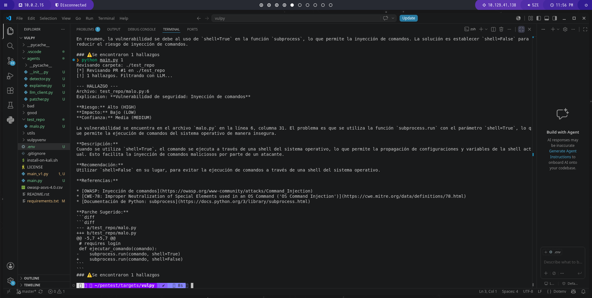

### Vulpy v1.0 

Crea/reemplaza el `README.md` con esto:
# ⚡  Vulpy - AI-Enabled Secure Code Scanner ⚡

Pipeline de seguridad multi-agente que automatiza SAST, code review y auto-patching usando LLMs.

Vulpy escanea código con Semgrep, analiza hallazgos con GPT-4, explica la vulnerabilidad con contexto OWASP/CWE, genera parches `diff` y propone tests de validación.

## 🚀 Features v1.0

- **Agente 1 - Detector**: SAST con Semgrep `p/security-audit`
- **Agente 2 - Explainer**: Explicación en español con OWASP Top 10 y CWE
- **Agente 3 - Patcher**: Generación automática de parches `diff`
- **Agente 4 - Tester**: Tests `pytest` para validar el fix

## 📦 Instalación

```bash
git clone https://github.com/Migueltejada86/vulpy-ai-sec.git
cd vulpy-ai-sec
pip install semgrep openai python-dotenv
Crea un `.env` con tu `OPENAI_API_KEY`
```
## 🛠️ Uso
```python
python main.py <pr_number>
```

### 🎯 Demo
Escanea `test_repo/malo.py` y detecta `shell=True`:
[*] Revisando PR #1 en ./test_repo
[!] 1 hallazgos. Filtrando con LLM...

--- HALLAZGO ---
Archivo: test_repo/malo.py:6
Riesgo: Alto (HIGH)
Explicacion: Vulnerabilidad de seguridad: Inyección de comandos
Parche Sugerido: Cambiar shell=True a shell=False
Test Sugerido: pytest para validar el fix


## 🛣️ Roadmap v2.0

- [ ] CrewAI / Multi-Agent Framework
- [ ] SCA: pip-audit + npm audit
- [ ] SBOM con Syft
- [ ] Multi-lenguaje: Python, JavaScript, Java
- [ ] GitHub Actions CI/CD Security Gate

## 🧰 Tech Stack
`Python` `Semgrep` `OpenAI` `SAST` `AppSec`

## License
MIT

## 👨‍💻 Autor

GitHub: https://github.com/Migueltejada86
Hack The Box: miguelt86 🐍x💻